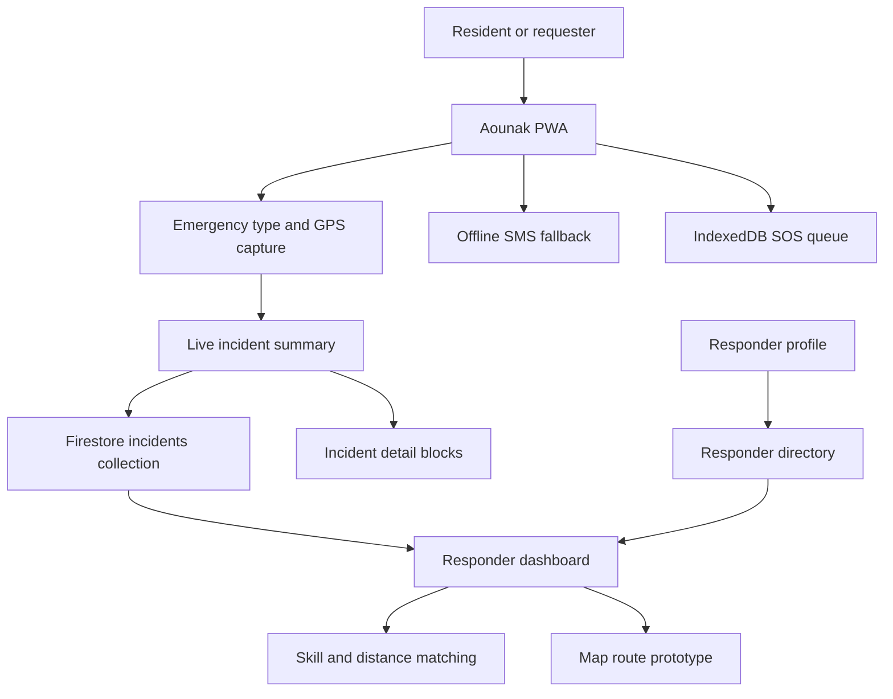

# Architecture

Aounak is a mobile-first Next.js PWA with Firebase-backed sync when configured and local fallback behavior for weak-connectivity demo paths.

## Frontend

- Next.js App Router with React and TypeScript.
- Tailwind CSS and shadcn/ui-style primitives for the interface.
- Mobile-first screens with a centered command-console layout on larger screens.
- App-wide English/Arabic language context and RTL direction support.

## Data And Auth

- Firebase Authentication supports email/password and Google sign-in.
- Firestore stores private profiles, public responder directory entries, incident summaries, and incident detail blocks.
- Local storage fallbacks keep the UI usable if Firestore is unavailable or blocked.

Primary collections:

| Collection | Purpose |
|---|---|
| `profiles/{uid}` | Private community profile with contact, vehicle, skills, medical notes, availability, and optional GPS |
| `responderDirectory/{uid}` | Public-safe responder matching profile |
| `incidents/{incidentId}` | Public-safe SOS summary for guest or signed-in emergency creation |
| `incidents/{incidentId}/blocks/{blockKey}` | Optional structured request details added after the live SOS |
| `weatherAlerts/{alertId}` | Future/prototype weather alert feed |

## Offline And PWA

- `public/manifest.json` defines app identity, icons, screenshots, and shortcuts.
- `public/sw.js` caches the app shell and local TensorFlow model files for production service-worker mode.
- `src/lib/storage.ts` queues SOS requests in IndexedDB and attempts sync when the browser comes back online.
- `src/lib/sms.ts` generates a prefilled SMS deep link with emergency type and coordinates.

## Geo, Matching, And Map

- Browser geolocation is used where available.
- SOS reports fall back to Al Qua'a demo coordinates if GPS is unavailable.
- `calculateDistance` uses the Haversine formula for skill/distance matching.
- Leaflet renders route comparison maps. Route metrics are prototype/demo values, not a certified routing engine.

## AI Prototype

The venomous-threat flow includes an on-device TensorFlow.js assistant using local model assets in `public/model`. It combines image predictions with symptom/body-location inputs to create responder context. It is assistive only and must not be treated as medical authority.
