

# Evidence and Testing

This document outlines the primary features of Aounak and their validation steps. It combines our end-to-end testing script with the main feature evidence, providing a single source of truth for the application's capabilities. Only core features that can be visually demonstrated are included.

## Main Features & Validation

| Feature / Action                 | Expected Result                                                                                              | Screenshot                                                    |
| -------------------------------- | ------------------------------------------------------------------------------------------------------------ | ------------------------------------------------------------- |
| **Public Emergency Flow**        | Welcome screen loads with SOS, login, and register actions, allowing public access without registration.     | 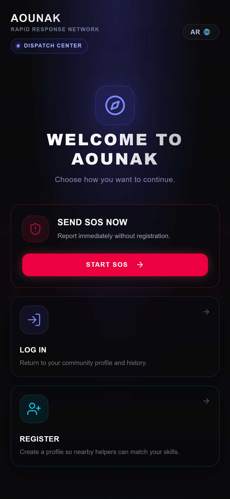                       |
| **SOS Selection Grid**           | Emergency type grid appears with options like Vehicle Stuck, Venomous Bite, Medical Assist, etc.             | 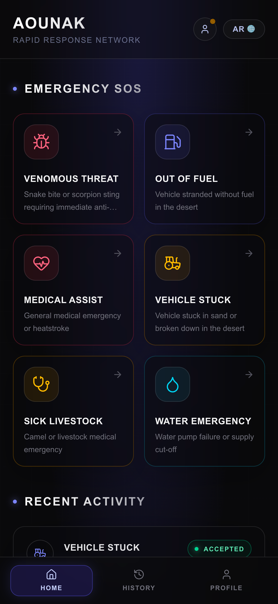           |
| **SOS Reporting & Coordinates**  | Specific report page opens with a coordinates panel, live digital SOS button, and optional detail forms.     | 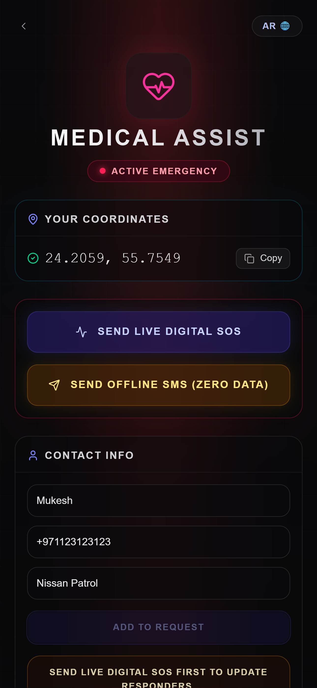 |
| **Voice-Commanded SOS AI**       | Microphone UI records emergency details, parses the NLP offline, and automatically fills the incident form.  | 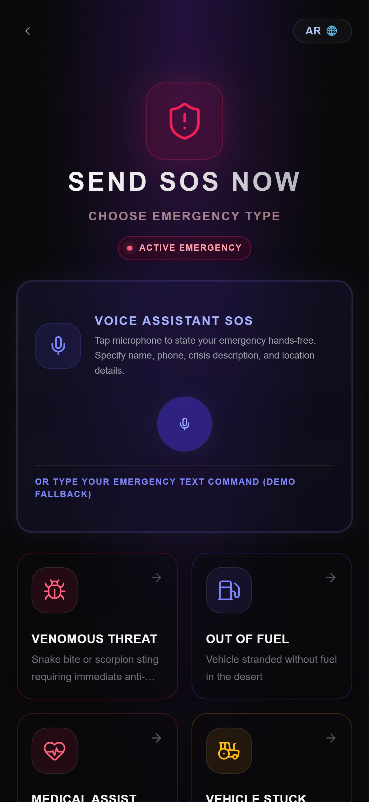                     |
| **Interactive Medical Selector** | Reusable visual Body Location Selector appears for Venomous Bites and Medical Assist to pinpoint injuries.   | 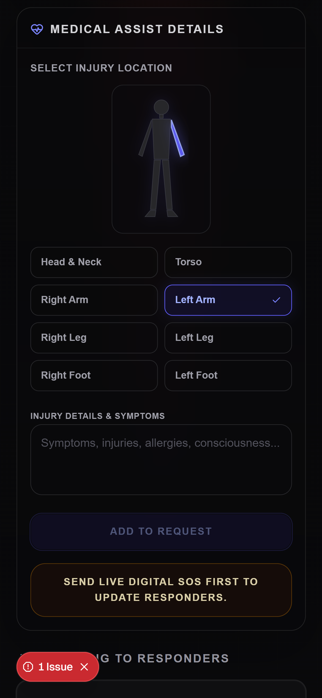           |
| **Offline SMS Fallback**         | An SMS deep link triggers, opening the native SMS app pre-filled with the emergency type and coordinates.    | 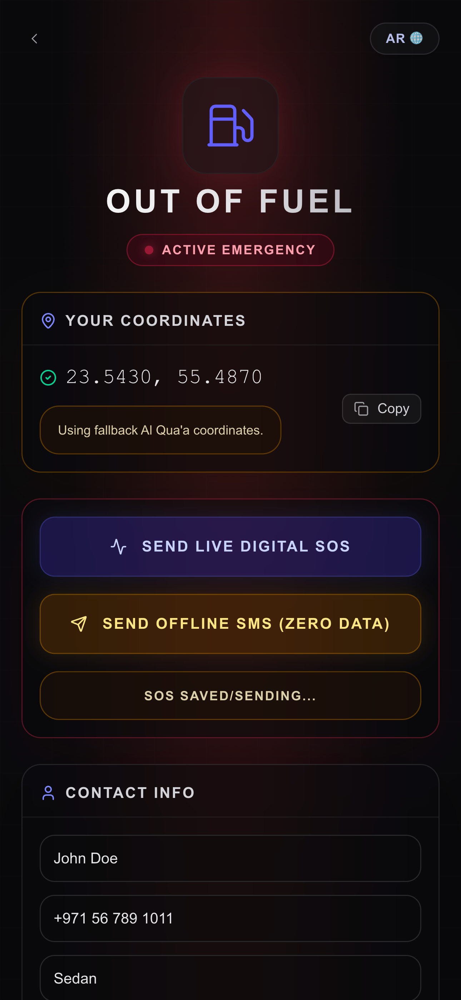               |
| **Dual Language Support**        | Toggling the language button seamlessly switches between English and Arabic, including RTL layout support.   | 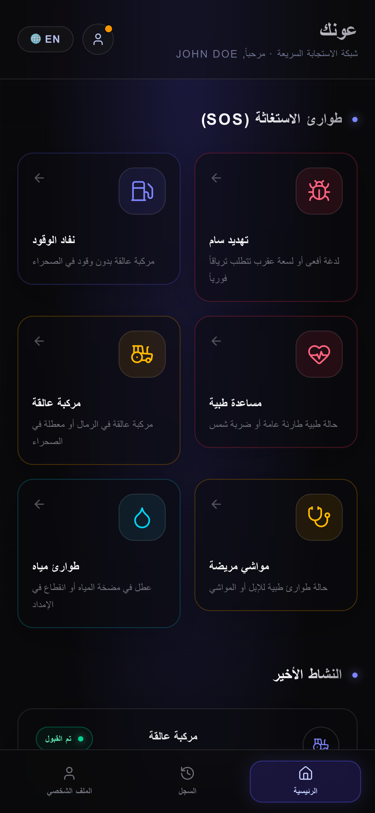           |
| **Profile Readiness**            | Profile page captures contact info, vehicle details, skills, and medical notes for authenticated responders. | 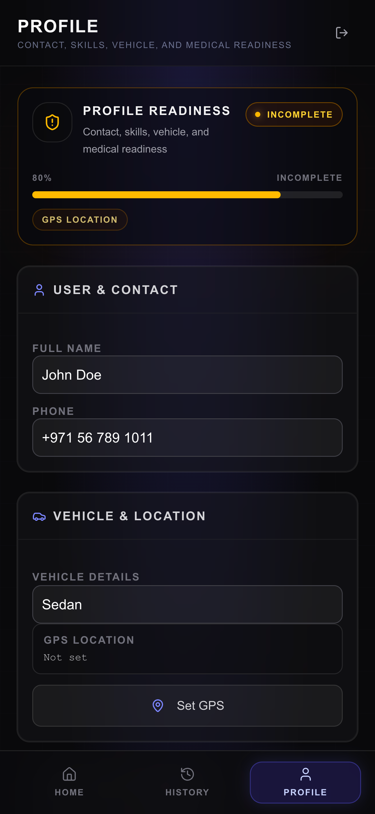   |
| **Home Dashboard**               | Dashboard shows active SOS tiles, map previews, and recent community activity state.                         | 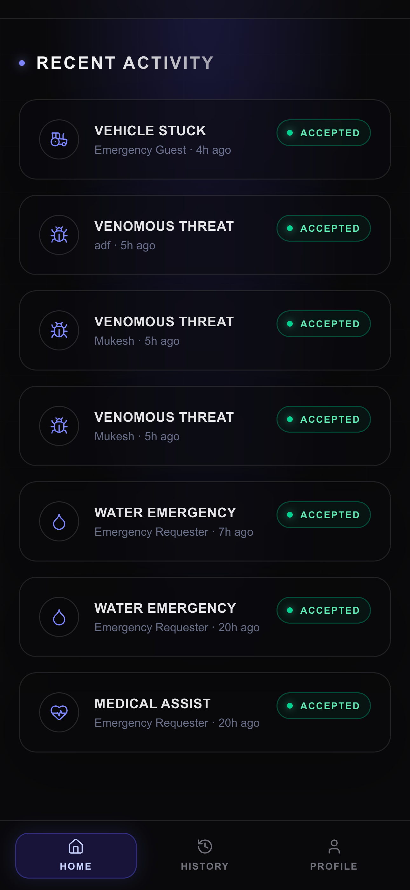       |
| **Activity History**             | History page displays a chronological log of incidents created or helped by the current user.                | 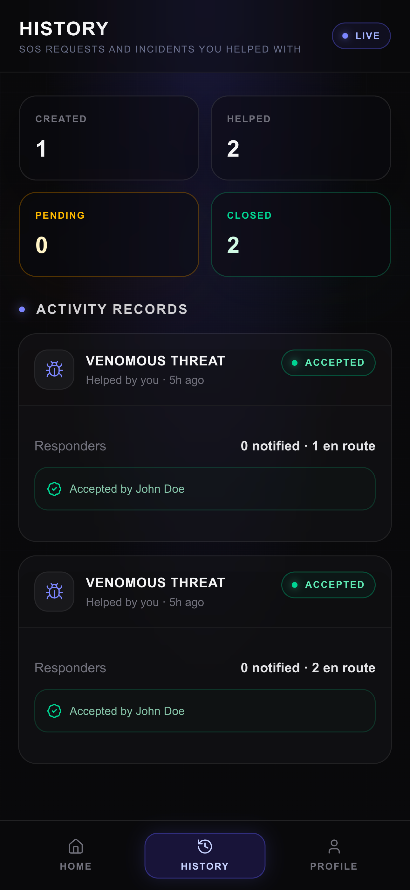                       |
| **Interactive Map Routing**      | Hybrid paved-to-offroad routing engine displays the route to an incident alongside active hazard reports.    | 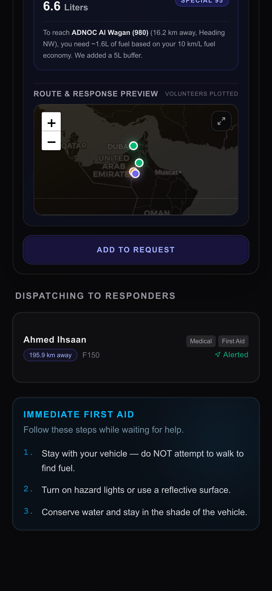                   |
